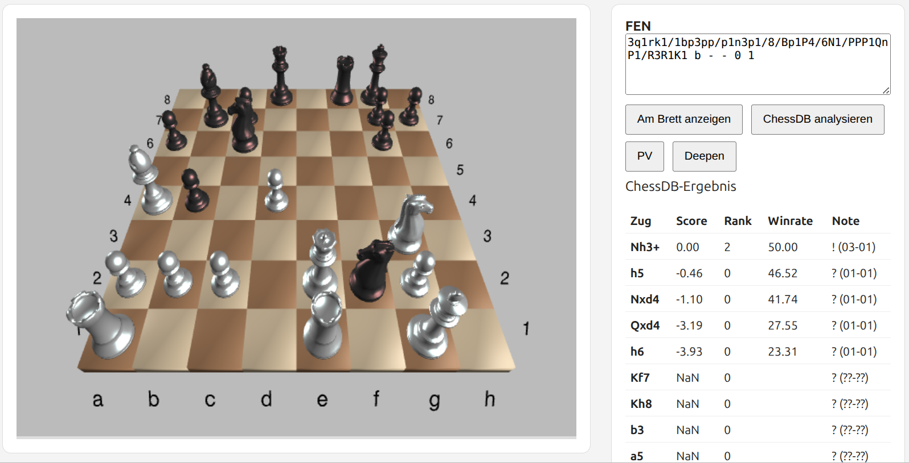

# Deep3DChessDB

Interaktives 3D-Schachbrett mit **ChessDB-Anbindung** für Stellungsanalyse, Kandidatenzüge und Hauptvarianten.

Deep3DChessDB kombiniert **chessboard3.js** als 3D-Renderer, **chess.js** als Regelkern und die öffentliche **ChessDB Cloud Database** als Analysequelle. Figuren können legal gezogen werden; nach jedem Zug wird die vollständige FEN aktualisiert und ChessDB automatisch neu abgefragt.



*Deep3DChessDB mit 3D-Brett, FEN-Eingabe und ChessDB-Kandidatenzügen.*

## Stabiler Release v0.1.1

- interaktives 3D-Schachbrett auf Basis von chessboard3.js
- legale Drag-and-drop-Züge mit chess.js
- Zugrecht, Rochade, en passant und automatische Damenumwandlung bei manuellen Bauernzügen
- automatische Aktualisierung der vollständigen FEN nach jedem legalen Zug
- automatische ChessDB-Abfrage nach jedem Zug
- ChessDB `queryall`: Kandidatenzüge, Score, Rank, Winrate und Note
- ChessDB `querypv`: Principal Variation / Hauptvariante
- ChessDB `querybest`, `queryscore` und `querysearch`
- `Deepen` / `queue`: Stellung zur weiteren ChessDB-Analyse einreihen
- automatische Behandlung unbekannter Stellungen mit `queue` und 5-Sekunden-Polling
- robuste Behandlung unbekannter Scores ohne `NaN`
- Same-Origin-PHP-Proxy mit HTTPS- und HTTP-Fallback für ChessDB
- 3D-Ansicht mit Maus drehen und kippen
- Mausrad-Zoom
- kleinere Koordinaten als echte 3D-Objekte direkt am Brett
- Buchstaben und Zahlen jeweils nur an einer Brettkante
- Button **Brett drehen** zum Wechsel der Orientierung

## Aktueller Entwicklungsstand: v0.1.2

Auf `main` sind zusätzlich bereits umgesetzt:

- ChessDB-Kandidatenzüge sind direkt anklickbar
- der angeklickte Zug wird über `chess.js` auf Legalität geprüft und ausgeführt
- das 3D-Brett wird anschließend aus der neuen FEN synchronisiert
- ChessDB wird nach dem Kandidatenzug automatisch erneut abgefragt
- sichtbarer Status für Weiß/Schwarz am Zug, Schach, Schachmatt, Patt und Remiszustände

Vor dem Tag `v0.1.2` ist noch der vollständige manuelle Regressionstest vorgesehen. Siehe [`docs/REGRESSION-v0.1.2.md`](docs/REGRESSION-v0.1.2.md).

## Schnellstart unter Windows

Am einfachsten geht es mit **`start.cmd`** im Projektordner: Doppelklick darauf genügt. Das Skript startet den lokalen PHP-Server auf Port `8011` und öffnet Deep3DChessDB automatisch im Standardbrowser.

Alternativ kann Deep3DChessDB jederzeit direkt aus PowerShell gestartet werden:

```powershell
cd D:\Deep3DChessDB-repo\Deep3DChessDB
php -S 127.0.0.1:8011
```

Dann im Browser öffnen:

```text
http://127.0.0.1:8011/chessdb-demo.html
```

Der Server läuft so lange, wie sein Konsolenfenster geöffnet bleibt. Beenden mit `Strg+C`.

Falls PHP noch nicht installiert ist:

```powershell
winget install --id PHP.PHP.8.4 -e
```

## Schnellstart unter Linux

Falls PHP-CLI noch fehlt:

```bash
sudo apt update
sudo apt install php-cli
```

Dann im Projektordner:

```bash
php -S 127.0.0.1:8011
```

und im Browser:

```text
http://127.0.0.1:8011/chessdb-demo.html
```

## Bedienung

Eine vollständige FEN kann in das Eingabefeld geschrieben und mit **Am Brett anzeigen** geladen werden. Danach können die Figuren direkt auf dem 3D-Brett gezogen werden. Illegale Züge springen zurück; legale Züge aktualisieren FEN und ChessDB automatisch.

Die freie Brettfläche kann mit gedrückter Maustaste gedreht und gekippt werden. Mit dem Mausrad wird gezoomt. **Brett drehen** wechselt die Orientierung zwischen Weiß und Schwarz.

Auf dem aktuellen `main` werden ChessDB-Kandidatenzüge als Buttons angezeigt. Ein Klick führt den jeweiligen Zug über `chess.js` aus und startet danach automatisch die Analyse der Folgestellung.

Zusätzlich stehen **ChessDB analysieren**, **PV** und **Deepen** zur Verfügung.

## Test-FEN

Startstellung:

```text
rnbqkbnr/pppppppp/8/8/8/8/PPPPPPPP/RNBQKBNR w KQkq - 0 1
```

Schachmatt-Test:

```text
7k/6Q1/6K1/8/8/8/8/8 b - - 0 1
```

Patt-Test:

```text
7k/5Q2/6K1/8/8/8/8/8 b - - 0 1
```

## Architektur

```text
Benutzerzug / FEN / ChessDB-Kandidat
              ↓
           chess.js
              ↓
        vollständige FEN
          ↙        ↘
chessboard3.js    ChessDB
```

`chessboard3.js` rendert das 3D-Brett. `chess.js` verwaltet die Schachregeln und ist die Quelle der Wahrheit für Legalität und vollständige FEN. Die ChessDB-Schicht fragt die externe Analyse-Datenbank über den lokalen PHP-Proxy ab.

Mehr dazu in [`docs/ARCHITECTURE.md`](docs/ARCHITECTURE.md).

## Projektstruktur

```text
.
├── start.cmd                    Windows-One-Click-Start
├── chessdb-demo.html            Demo und spielbares Analysebrett
├── chessdb-proxy.php            Same-Origin-Proxy zu ChessDB
├── js/
│   ├── chessboard3.js           3D-Renderer
│   ├── chessboard3.min.js
│   └── chessboard3.chessdb.js   ChessDB-Integrationsschicht
├── assets/                      3D-Figuren und Fonts
├── docs/
│   ├── ARCHITECTURE.md
│   └── REGRESSION-v0.1.2.md
├── ROADMAP.md
├── CHANGELOG.md
└── LICENSE
```

## Nächste Schritte

Nach dem Regressionstest und dem Tag `v0.1.2` folgen PGN-Unterstützung, Zugliste, Navigation und Variantenbaum.

Siehe [`ROADMAP.md`](ROADMAP.md).

## Herkunft und Lizenz

- **chessboard3.js**: Copyright 2016 Jason Tiscione; Teile Copyright 2013 Chris Oakman. MIT-Lizenz, siehe [`LICENSE`](LICENSE).
- **chess.js**: wird im Demo-Frontend als Regel-Engine eingebunden.
- **ChessDB**: externe Cloud-API von chessdb.cn. Dieses Projekt enthält keine ChessDB-Datenbankkopie und keinen ChessDB-Server. Der veröffentlichte ChessDB-Code steht unter der Unlicense/Public-Domain-Widmung.
- Die zusätzliche Integrationsschicht in diesem Repository wird unter den permissiven Bedingungen des beigefügten MIT-Lizenztexts veröffentlicht.

## Status

**v0.1.1 ist der stabile Release. `main` bereitet v0.1.2 vor.**
